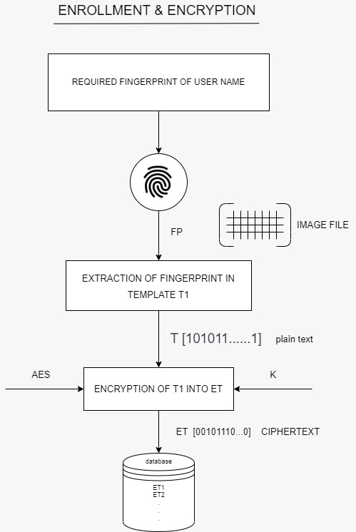
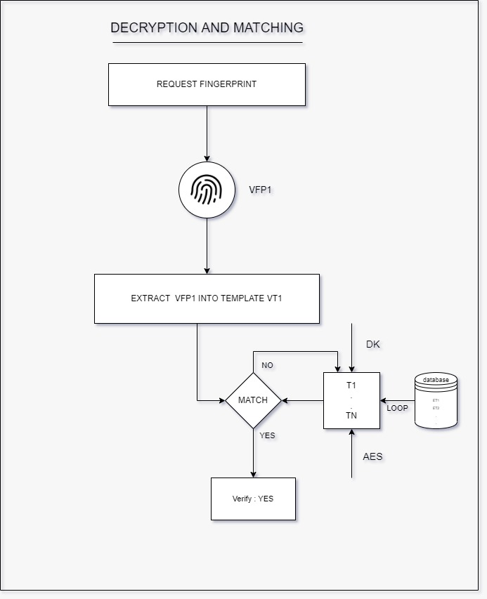

# Encryption of biometric fingerprint templates

April - July 2021
- Padmapriya Mohan, Rishab Raj, Priti Das, Sonali

Through this project, we attempt to design and implement an encryption scheme that takes as plaintext a biometric fingerprint template and encrypts it, in order to implement a secure authentication and identification system. 

We develop a fingerprint auhentication system that ensures - 

• Confidentiality: Even if an adversary is able to access a template, they must
not be able to decrypt it.

• Integrity: The adversary should not be able to manipulate a fingerprint tem-
plate in any way.

• Revocability: It must be possible to identify and revoke a compromised tem-
plate, and reissue a new one that is representative of the user’s true fingerprint.

• Unforgeability: 
The system must ensure ciphertexts cannot be existentially
forged using fingerprint spoofs.

• Efficiency: The encryption scheme must not bear significantly on the speed
of the matching algorithm.

This project makes use of - 
- Arduino Uno
- R307 fingerprint sensor module

## Algorithms

